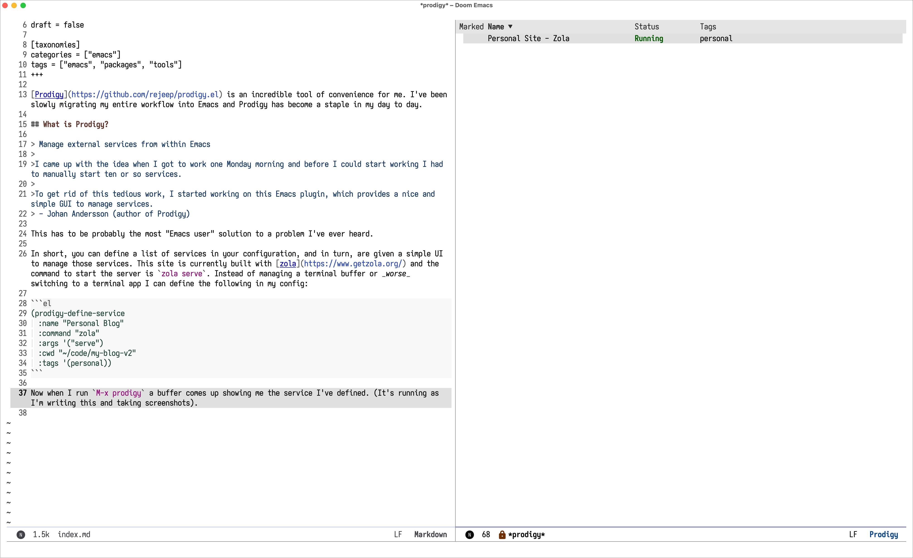
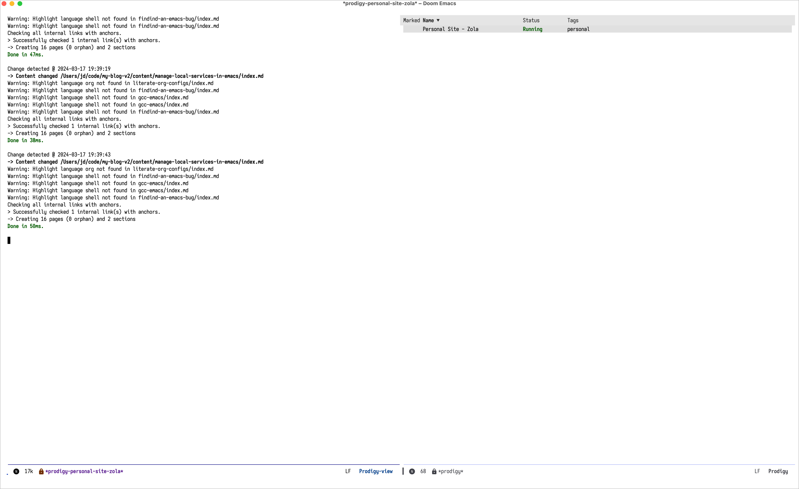

+++
title = "Managing Local Services in Emacs with Prodigy"
description = ""
slug = "emacs-prodigy"
date = 2024-03-15
draft = false

[taxonomies]
categories = ["emacs"]
tags = ["emacs", "packages", "tools"]
+++

[Prodigy](https://github.com/rejeep/prodigy.el) is an incredible tool of convenience for me. I've been slowly migrating my entire workflow into Emacs and Prodigy has become a staple in my day to day. 

## What is Prodigy?

> Manage external services from within Emacs
>
>I came up with the idea when I got to work one Monday morning and before I could start working I had to manually start ten or so services.
>
>To get rid of this tedious work, I started working on this Emacs plugin, which provides a nice and simple GUI to manage services.
> 
> -- Johan Andersson (author of Prodigy)

This has to be probably the most "Emacs user" solution to a problem I've ever heard. 

In short, you can define a list of services in your configuration, and in turn, are given a simple UI to manage those services. This site is currently built with [zola](https://www.getzola.org/) and the command to start the server is `zola serve`. Instead of managing a terminal buffer or _worse_ switching to a terminal app I can define the following in my config:

```el
(prodigy-define-service
  :name "Personal Blog"
  :command "zola"
  :args '("serve")
  :cwd "~/code/my-blog-v2"
  :tags '(personal))
```

Now when I run `M-x prodigy` a buffer comes up showing me the service I've defined. (It's running as I'm writing this and taking screenshots).

<a href="./prodigy.jpeg" target="_blank" rel="noopener noreferrer"></a>

You can also very easily open a buffer with the log output for inspecting/debugging:

  <a href="./prodigy-log.jpeg" target="_blank" rel="noopener noreferrer"></a>

This interface takes a lot of inspiration from `dired` in that services can be marked and then acted upon in some way so you can start or stop multiple services at one time. In the UI, you can filter services by tags or name, which allows you to build groups of services really easily that pertain to a particular project. After filtering your defined services, you can then select all of them with `prodigy-mark-all` and then `prodigy-start` to kick them all off.

Here's a list of all the default keybindings in the `prodigy-mode` buffer:

<!-- lol wat -->
| key   ||||||function                  |
|-------||||||--------------------------|
| `n`   ||||||prodigy-next              |
| `p`   ||||||prodigy-prev              |
| `M-<` ||||||prodigy-first             |
| `M->` ||||||prodigy-last              |
| `m`   ||||||prodigy-mark              |
| `t`   ||||||prodigy-mark-tag          |
| `M`   ||||||prodigy-mark-all          |
| `u`   ||||||prodigy-unmark            |
| `T`   ||||||prodigy-unmark-tag        |
| `U`   ||||||prodigy-unmark-all        |
| `s`   ||||||prodigy-start             |
| `S`   ||||||prodigy-stop              |
| `r`   ||||||prodigy-restart           |
| `$`   ||||||prodigy-display-process   |
| `o`   ||||||prodigy-browse            |
| `f t` ||||||prodigy-add-tag-filter    |
| `f n` ||||||prodigy-add-name-filter   |
| `F  ` ||||||prodigy-clear-filters     |
| `j m` ||||||prodigy-jump-magit        |
| `j d` ||||||prodigy-jump-file-manager |
| `M-n` ||||||prodigy-next-with-status  |
| `M-p` ||||||prodigy-prev-with-status  |
| `C-w` ||||||prodigy-copy-cmd          |

## Tags
Here's a more intense use case. The product I work on at my day job has about 26 services accross a couple different applications, databases, cache systems, asset compilers/transpilers, kafka consumers, and background job servers.


```el
;; In eshell
~ λ (length (prodigy-services-tagged-with 'work))

26
```

The default on my team is to use 3 different Procfiles in 2 different repositories to spin everything up. That's a _pain_ honestly, especially when you have to inspect logs that are intermingled with half a dozen other service logs. [Overmind](https://github.com/DarthSim/overmind) has been suggested and has some support in my engineering org, but being pushed into using tmux is more annoying than anything to me.

Tags are **very** useful for me as not only can I quickly select a subset of services, but I can also add some shared configuration among similar services. Here's the tag I use for all the Kafka consumers:

```el
(prodigy-define-tag
  :name 'cf-consumer
  :ready-message "=> Ctrl-C to shutdown consumer")
```

You can see here that it indicates a `ready-message`. This tag attribute will utilize Prodigy's log "identifying" regex in order to tell Prodigy that a service is status "ready". This regex is matched against all log output until it's matched, at which point Prodigy will identify the service status as "ready". This makes it easy to manually tell Prodigy exactly when a service is done spinning up. Here's another tag:

```el
(prodigy-define-tag
  :name 'rails
  :on-output (lambda (&rest args)
               (let ((output (plist-get args :output))
                     (service (plist-get args :service)))
                 (when (or (s-matches? "Listening on 0\.0\.0\.0:[0-9]+, CTRL\\+C to stop" output)
                           (s-matches? "Use Ctrl-C to stop" output))
                   (prodigy-set-status service 'ready)))))
```

This is basically ripped straight from Prodigy's README but it works like a charm for me. Every output log line will run this callback and is useful for triggering custom side effects or, as I'm doing here, telling prodigy the service is ready. I run 3 Rails apps so being able to just tag them all with `'rails` makes it easy to add the configuration everywhere without rewriting it everytime and tells me what behavior the Prodigy services is relying on at a glance in the prodigy buffer. You don't _have_ to do it this way, I just found it useful to experiment with as I was configuring things, so I left it.

## Service Definitions

Prodigy is such a simple package and it's configuration api is also very simple, but for completeness sake here I'll explain a bit more about configuring services.

```el
(prodigy-define-service
  :name "esbuild-app"
  :cwd "~/code/admin"
  :command "yarn"
  :args '("build" "--watch")
  :ready-message "successfully rebuilt - now reloading"
  :tags '(work cf-frontend))

(prodigy-define-service
  :name "cf-chat-frontend"
  :command "webpack-dev-server"
  :args '("s" "-p" "5002")
  :cwd "~/code/cfchat"
  :path '("~/code/cfchat/bin")
  :ready-message "Built at:"
  :tags '(work))
```

The configuration is fairly straight forward. The `name`, `command`, and `args` are all defined as you'd expect. Then `cwd` will be the path to the directory where the `command` should be executed. In some cases, the binary for the command you need to run isn't in `$PATH` so you can optionally provide `path` which will tell Prodigy the path of the binary to run. Both of these services define their own `ready-message` since they're unique compared to the rest of the services. Then finally we just add the list of tags.

A few additional options not in my examples are:

- `:env` to add environment variables as needed to the command. ex. `:env '(("ENV_VARIABLE" "value"))`
- `:stop-signal` the type "kill signal" to send the process to stop it. I haven't needed to do this myself, so I'm not 100% sure how it works.
- `:kill-process-buffer-on-stop` which will kill the log output buffers completely when the service is stopped. By default, they persist for an entire emacs session unless killed manually.

Check out the projects [README](https://github.com/rejeep/prodigy.el?tab=readme-ov-file#usage) for more in depth options than what's provided here.

Here's an exact play-by-play of all the commands I use and how I do this everytime I want to spin things up at work.
<details>
<summary>Play-by-play</summary>

Since I use doom-emacs as my base distribution, YMMV on some of the keybindings here but:

1. `SPC r s` - runs `(prodigy)` which opens buffer
2. `i t` - runs `(prodigy-add-tag-filter)`
3. Type `wo` - fills in completing read for "work" tag.
4. `RET` - applies the filter
5. `M` - runs `(prodigy-mark-all)`
6. `s` - runs `(prodigy-start)`
7. Wait for a bit for all them to spin up
8. Begin work...
</details>

<br />
That's the intro to Prodigy and managing local services with it. If you're interested in a few things on my todo-list to implement for myself for your own inspiration read on...

## Future Customizations

- Modeline integration
  - Place the number of running services for a project or with a specific tag output in the modeline. I'd also like to map this to `projectile-project-root` and a `tag` so as I'm switching projects or repositories, I can keep a birds eye view of the services running at a glance in the modeline.
  - Utilize `prodigy-output-filters` to either alert me or dump a message in the modeline so I can easily be notified of exceptions being raised in the log output of a particular buffer.
- Additional macro-esque keybindings
  - Whenever I switch branches, I'd like to run one keybinding to kill all services running, run a sync command for the project, and then re-start all the services for a project with some message output or a `compilation-mode` style "logging."
- Dynamically create Prodigy services from Procfile entires and/or conventional rails, yarn, or npm commands based on the project.


