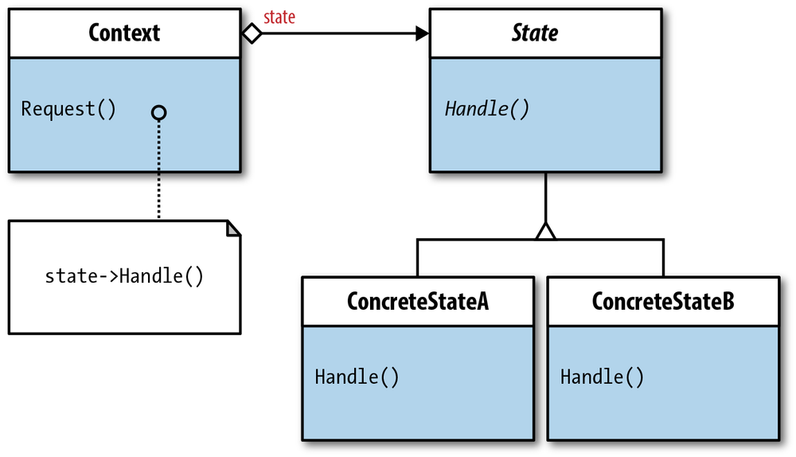

+++
title = "State Design Pattern"
description = "State Design Pattern is often overlooked in favor State Machines when it comes to Rails and object state management. However, the State Design Pattern is a highly effective open/closed solution to many state design woes."
slug = "state-design-pattern"
date = 2021-06-08
draft = false

[taxonomies]
categories = ["development"]
tags = ["#100DaysToOffload", "rails", "programming", "OO Design"]
+++

{{ offload(number = 6) }}

Manging the state of objects and state specific behavior is always an interesting problem to deal with. The Rails community has done a great job of developing libraries to help manage this. Most of these libraries come in the form of State Machines. These typically have the pattern of defining states, events to change states, and constraints by which those states can or cannot change. Usually, this code is maintained in your model, and in some cases states can have their very own model and DB table and keep an audit history of some kind.

### The Problem
A lot of state machines require code to be placed directly in the model and have mechanisms by which side effects can be called. With a complex state machine, or a state machine that evolves over time, this can create a lot of odd behavior and weird dependencies on side effects at each transition. This quickly becomes hard to troubleshoot and hard to test and (even worse) can also result in transition events that only fire in order to fire their side effects or "reset" the state because of an error that occurred down stream. For a simple state management use case that has a consistent set of linear flows and minimal side effects, a state machine would probably be a good fit. However, when things grow beyond that, or when mulitple objects are having to interact as a result of the state transitions we need to look for something more robust, easily extensible, and that follows good object oriented design principals: The State Design Pattern.

#### Side Note
I highly recommend picking up a copy of Design Patterns: Elements of Resuable Object Oriented Software as these patterns are rather timeless and the material is easily referenceable.

### State Design Pattern

#### Overview
The State Design pattern that at it's core allows you to manage your objects state specific behavior in a state object concrete class. This concrete class inherits from an abstract super class that defines the public interface, which acts as your contract to the outside world. In Rails, all of this can be confined into a concern to share this behavior with other objects if necessary. For now though, lets look at at a simple example implementation with just plain old Ruby.

Here we have a Post object. It has an id and content and when the object is initialized it's always initialized by being in a `draft`state.

```ruby
class Post
  attr_accessor :id, :content

  def initialize(id, content)
    @id = id
    @content = content
  end

  def post_to_socials
    puts "Posted to social accounts!"
  end
end
```
We have not defined any state behavior yet, just building the foundation for the example so the rest is easy to follow.

The state design pattern typically starts off with an abstract class that defines the proper interface that every subclass, concrete state object, has to implement.
 ```ruby
class State
  attr_reader :context

  def initialize(context)
    @context = context
  end

  def unpublish
    raise NotImplementedError
  end

  def current_state
    raise NotImplementedError
  end

  def publish
    raise NotImplementedError
  end

  def archive
    raise NotImplementedError
  end

  def log_state(state)
    puts "Transitioning from: #{context.state.current_state} to: #{state}"
  end
end
 ```
The `@context` variable is set to the current object implementing this state, so in this case a `Post`. It allows us to make object specific method calls as we need and update the object attributes as transitions happen. This is also were any global behavior that happens among ALL states can be placed. It's important to note, that if you do want to implement some kind of global validation or side effect (like logging), that every single child class implements that behavior. It would be unwise to use conditionals to determine whether or not to call a side effect or validation in the super class, even if 5 out of 6 of your child classes need it. Prefer duplication over the wrong abstrction ;).

Up next we have the concrete state classes. These can be anything but they should inherit from the abstract `State` class.
```ruby
class DraftState < State
  def current_state
    "draft"
  end

  def unpublish
    raise StandardError "Cannot unpublish post in draft state."
  end

  def publish
    post_to_socials
    log_state("published")
    context.state = PublishedState.new(context)
  end

  def archive
    log_state("archived")
    context.state = ArchivedState.new(context)
  end

  private

  def post_to_socials
    context.post_to_socials
  end
end

class PublishedState < State
  def current_state
    'published'
  end

  def unpublish
    log_state("unpublished")
    context.state = DraftState.new(context)
  end

  def publish
    raise StandardError "Cannot publish already published post!"
  end

  def archive
    log_state("archived")
    context.state = ArchivedState.new(context)
  end
end

class ArchivedState < State
  def current_state
    'archived'
  end

  def unpublish
    log_state("unpublished")
    context.state = DraftState.new(context)
  end

  def publish
    log_state("published")
    context.state = PublishedState.new(context)
  end

  def archive
    raise StandardError "Cannot archive already archived post!"
  end
end
```

Now we can see the full power of this state design pattern. Every state is it's own object implementing every method from it's super class. Each one controls it's transition to the next state and calls any and all side effects necesssary to the transtiion of each state. 

In `DraftState#publish` we fire off the `post_to_socials` side effect. Lets say this method fails, and our domain requires this to succeed before publishing. Well here we can implement that fairly easily.

```ruby
# draftState.rb
def publish
  post_to_socials
  log_state("published")
  context.state = PublishedState.new(context)
  rescue SocialPoster::Error # completely arbitrary error class
    log_state("unpublished")
  end
end
```
This will prevent a state update from happening when the necessary behavior has not taken place.

Ok now lets actually make this behavior accessible to the Post object. This will use delegation in order to preserve an easy predictable API for changing states.
```ruby
class Post
  attr_accessor :id, :content, :state

  def initialize(id, content)
    @id = id
    @content = content
    @state = DraftState.new(self) # Initial state
  end

  # Delegated
  def current_state
    @state.current_state
  end

  # Delegated
  def publish
    @state.publish
  end

  # Delegated
  def archive
    @state.archive
  end

  def post_to_socials
    puts "Posted to social accounts!"
  end
end
```
As you can see, this is simply delegating any and all state calls to the relevant state object.

#### Importance of this pattern
This implementation is very _Open/Closed_ meaning, it's **open for extenstion** and **closed to modification**. This is the O in [**SOLID**](https://www.digitalocean.com/community/conceptual_articles/s-o-l-i-d-the-first-five-principles-of-object-oriented-design). This allows us to extend it's behavior without modifying existing behavior which is a powerful tool in software development and a core principal of OOP. At any point, adding a new state is just adding a couple methods and creating the state object you'd wish to implement and that's it. This is personally why I prefer to use this type of pattern over a state machine.

State machines, if not planned and maintained well easily get out of hand. They tend to have to handle a multitude of things that can make coupling code too easy. Typically they can handle before & after transition side effects, guards to prevent state transition happening, etc. This can introduce some confusion into your code as corners are inevitably cut due to business needs. This also means that testing each transtion requires the instantiation of the object implementing and following it through each individual transition. Testing with the state design pattern instead gives a great entrypoint to just testing the individual objects, allowing you to have confidence your state machine is working just as you intended. This is also good for complex state machines, where you have dependencies on the state of other objects, or you need mulitple objects to implement this same exact state machine. This can be easily abstracted and states can be predetermiend by a value and a method to set itself.

All in all my focus on writing good OOP code has revealed a lot of interesting things I take for granted in the Ruby community. State machines were definitely something I never realized could be simplified into smaller objects like this and now that I have, I can't think of a scenario where I would use a state machine unless the state transitions were finite, well defined, and dependencies were kept to a minimum, even so I might elect for this pattern by virtue of it's testability alone.

